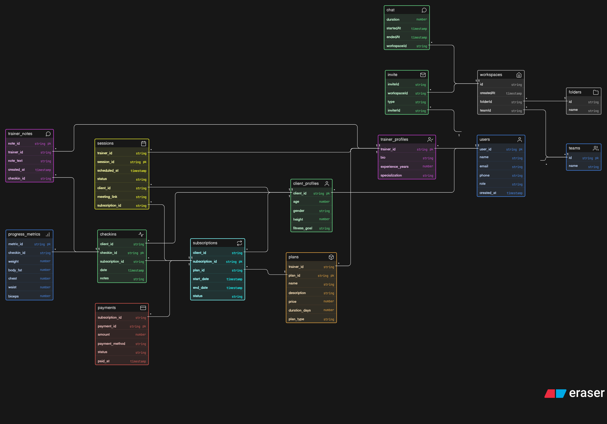

# Fitness Influencer Coaching Platform – ER Diagram

## 📌 Overview

This project presents the ER diagram for an online fitness coaching platform where trainers/influencers manage clients, sell coaching plans, schedule sessions, and track client progress.
---

## 🧱 Core Entities

The following key entities are included in the design:

* **User** → Base entity for both trainers and clients
* **TrainerProfile** → Additional details for trainers
* **ClientProfile** → Fitness-related details for clients
* **Plan** → Coaching programs created by trainers
* **Subscription** → Represents a client purchasing a plan
* **Session** → Scheduled consultations or meetings
* **CheckIn** → Regular client progress updates
* **ProgressMetric** → Tracks measurable fitness data (weight, body stats, etc.)
* **TrainerNote** → Feedback provided by trainers
* **Payment** → Stores payment and transaction details

---

## 🔗 Relationships

* One trainer can create multiple plans
* One client can subscribe to multiple plans over time
* One plan can have multiple subscribers
* Each subscription can have multiple sessions and check-ins
* Each check-in can store multiple progress metrics
* Trainer notes are linked to check-ins
* Payments are linked to subscriptions

---

## 📷 ER Diagram

---

## 📁 Files

* `erd.png` → ER Diagram image
* `README.md` → Project documentation
